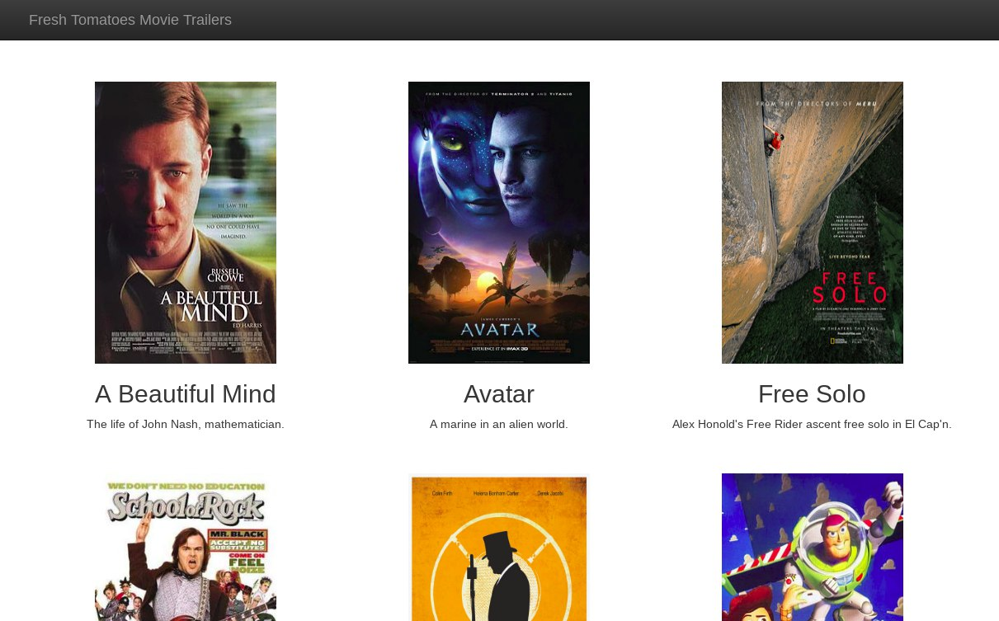

# Fresh Tomatoes

Server-side code for Udacity's Full-Stack Web Dev Nanodegree assignment.

## About

A web page for watching movies trailers. Developed using python, javascript, html, css and bootstrap. Movie's trailers can be watched upon clicking on the selected movie poster.

## The Assignment

Students were given a fresh_tomatoes python file, wich generates a webpage for watching movies trailers. This file takes a list with objects with certain attributes to work. Writing down the remaining code for it to run properly was a requirement as was reading the given file and trying to understand It. Changing the layout wasnt a must, but encouraged.

### How to run

Provided that Python3 is already installed on the machine, just run `entert_center.py` file in terminal as `python3 entert_center.py`.

### Specifics

Regarding what we've been taught and shown, this code differs as it sorts the movies alphabetically. Also, the javascript animation upon loading the movies tiles were changed as well.

### Screens

## Copyrights

`fresh_tomates.py` file were given by Udacity. All trailers were found on YouTube.
